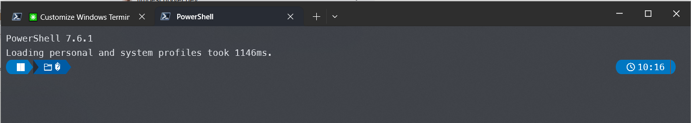
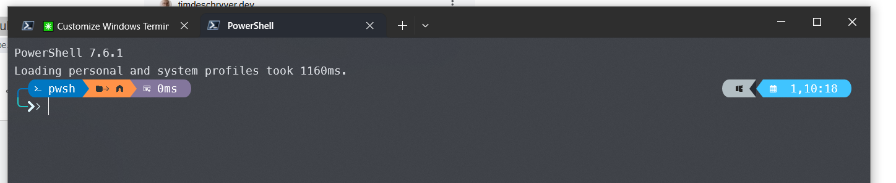

# dotfiles

Windows Terminal configuration with a custom prompt, icons, and visual effects.

## Before & After

**Before** — plain default terminal:



**After** — fully pimped:



---

## What's included

| File | Purpose |
|---|---|
| `ohmyposh.omp.json` | Oh My Posh theme (atomic) |
| `profile.ps1` | PowerShell profile — loads prompt, icons, IntelliSense |
| `windows-terminal-settings.json` | Windows Terminal — font, transparency, color scheme |
| `install.ps1` | One-shot setup script |

---

## What the prompt shows

**Left side**

| Segment | Color | Meaning |
|---|---|---|
| `pwsh` | Blue | Shell name |
| `→ 🏠 / folder` | Orange | Current directory (`🏠` = home, folder name otherwise) |
| `⊡ 0ms` | Purple | Execution time of the last command (hidden under 1ms) |
| Branch + status | Yellow | Git branch, dirty/ahead/behind indicators (only inside git repos) |

**Right side**

| Segment | Meaning |
|---|---|
| Windows logo | OS indicator |
| `Thu 01 May 10:18` | Day of week, date, month, and current time |

The `>>` on the second line is the input cursor — it turns **red** if the last command failed.

---

## Prerequisites

- [Windows Terminal](https://aka.ms/terminal)
- [PowerShell 7+](https://aka.ms/powershell)
- [winget](https://learn.microsoft.com/en-us/windows/package-manager/winget/) (comes with Windows 11 / Windows 10 1809+)
- A GitHub account (optional, only needed to clone via git)

---

## Installation

### 1. Clone the repo

```powershell
git clone https://github.com/balgaly/dotfiles
cd dotfiles
```

> If git isn't installed yet:
> ```powershell
> winget install Git.Git --accept-package-agreements --accept-source-agreements
> ```
> Then open a new terminal and retry.

### 2. Run the install script

```powershell
.\install.ps1
```

This will:
1. Install **Oh My Posh** (custom prompt engine)
2. Install **MesloLGLDZ Nerd Font** (required for icons)
3. Install **Terminal-Icons** PowerShell module (file/folder icons in `ls`)
4. Copy `ohmyposh.omp.json` → `~\.ohmyposh.omp.json`
5. Copy `profile.ps1` → your PowerShell profile
6. Copy `windows-terminal-settings.json` → Windows Terminal settings (if installed)

### 3. Restart Windows Terminal

Close and reopen Windows Terminal. The styled prompt will appear immediately.

---

## Keyboard shortcuts

| Shortcut | Action |
|---|---|
| `Ctrl+Shift+T` | New tab |
| `Ctrl+Shift+W` | Close current pane |
| `Alt+Shift+D` | Split pane |
| `Tab` | Menu-style autocomplete |
| `↑` / `↓` | Search command history |

---

## Customization

### Change the prompt theme

Browse themes at [ohmyposh.dev/docs/themes](https://ohmyposh.dev/docs/themes), then download one:

```powershell
Invoke-WebRequest -Uri "https://raw.githubusercontent.com/JanDeDobbeleer/oh-my-posh/main/themes/THEME_NAME.omp.json" -OutFile "$HOME\.ohmyposh.omp.json"
```

### Change the date format

Edit `ohmyposh.omp.json` and find `time_format`. Uses Go time format syntax:

```json
"time_format": "Mon 02 Jan 15:04"
```

Common tokens: `Mon` (3-letter day), `02` (day), `Jan` (3-letter month), `2006` (year), `15:04` (24h time), `3:04 PM` (12h time).

### Change transparency

Edit `windows-terminal-settings.json`:

```json
"opacity": 85,
"useAcrylic": true
```

`opacity` ranges from `0` (fully transparent) to `100` (solid).
