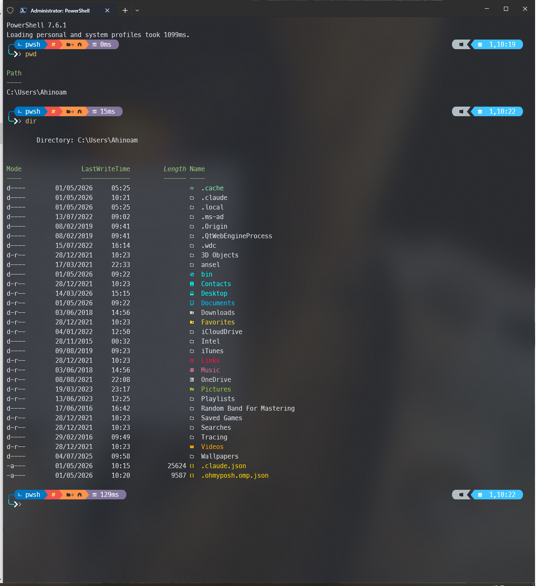

# dotfiles

> Windows Terminal setup with **12 hand-crafted themes** that auto-rotate twice a day so your prompt never feels stale. One in the morning, a different one at night, all from artists with very different visions.



---

## How the rotation works

| Time | Pool | What happens |
|---|---|---|
| **06:00 – 17:59** | 4 light themes | A random light theme is picked at 06:00 and stays all morning |
| **18:00 – 05:59** | 8 dark themes | A random dark theme is picked at 18:00 and stays all evening |

The pick is locked into a "slot" — opening 50 new tabs in the same morning all show the same theme. At 06:00 and 18:00, the next slot rolls a fresh one.

Override anytime:

```powershell
Set-Theme list             # show all 12
Set-Theme 02-synthwave     # pin a specific theme
Set-Theme random           # re-roll within the current slot's pool
Set-Theme auto             # clear pin, return to time-based rotation
```

---

## The 12 themes

### Light (morning rotation)

| # | Name | Persona | Style |
|---|---|---|---|
| 04 | `04-notebook` | Notebook Sketch | Cream paper, pencil grey, hand-written feel — `~/code — on "main" (unsaved)` |
| 05 | `05-material-light` | Material Designer | Google Material chips: blue · green · amber. Includes weather (wttr.in) |
| 08 | `08-pastel-dream` | Pastel Dream | Cotton-candy pink/lavender/mint, battery indicator, soft typography |
| 11 | `11-origami` | Origami Folder | Folded-paper geometry, sharp diagonals, muted earth tones (terracotta + cream) |

### Dark (evening rotation)

| # | Name | Persona | Style |
|---|---|---|---|
| 01 | `01-brutalist` | Brutalist Architect | Pure black, white text, ASCII brackets. `[ /path :: branch ]` — maximum signal, zero decoration |
| 02 | `02-synthwave` | Synthwave Kid (1986) | Neon pink + cyan + purple gradients, retrowave time display `15:04:05` |
| 03 | `03-tokyo-night` | Tokyo Night Hacker | Soft purple/blue palette. Shows node, python, go versions + kubectl context |
| 06 | `06-cyberpunk` | Cyberpunk Netrunner | Yellow-on-black, ALL CAPS path, "ALERT" on dirty git, live CPU % |
| 07 | `07-forest-druid` | Forest Druid | Moss greens + warm wood browns, current moon phase emoji 🌒🌓🌔 |
| 09 | `09-vt100` | Terminal Veteran (1979) | Pure VT100 green-on-black. `[user@host /path](branch*) $` — text only, no Nerd glyphs |
| 10 | `10-glassmorphism` | Glassmorphism | Translucent indigo gradient blocks, weather + CPU % + day/time |
| 12 | `12-matrix` | Matrix Operator | Falling-code green, katakana glyphs `ツツツ user・/path ソmain` — very Mr. Robot |

> **Want screenshots of every one?** Run `.\capture-all-themes.ps1` from inside Windows Terminal — it'll snap each one to `screenshots/themes/`.

---

## Stack

| Tool | Purpose |
|---|---|
| [Oh My Posh](https://ohmyposh.dev) | Prompt engine driving all 12 themes |
| [MesloLGLDZ Nerd Font](https://www.nerdfonts.com) | Font with the icons themes need |
| [Terminal-Icons](https://github.com/devblackops/Terminal-Icons) | File & folder icons in `ls` |
| [PSReadLine](https://github.com/PowerShell/PSReadLine) | History-based IntelliSense |

---

## Install

```powershell
# 1. Install git if you don't have it
winget install Git.Git --accept-package-agreements --accept-source-agreements

# 2. Clone and run
git clone https://github.com/balgaly/dotfiles
cd dotfiles
.\install.ps1

# 3. Restart Windows Terminal
```

The installer:
1. Installs Oh My Posh, the Nerd Font, and Terminal-Icons
2. Sets `DOTFILES_ROOT` env var so the profile knows where the themes folder lives
3. Backs up your existing `$PROFILE` to `$PROFILE.bak` then copies in the new one
4. Applies the Windows Terminal settings (acrylic, font, keybindings)

---

## Daily commands

| Command | Action |
|---|---|
| `Set-Theme list` | Show all 12 themes grouped by light/dark |
| `Set-Theme <name>` | Pin one (overrides rotation until you say `auto`) |
| `Set-Theme random` | Re-roll a different theme in the current slot |
| `Set-Theme auto` | Clear the pin, go back to time-based rotation |
| `.\update.ps1` | Sync your live config back into the repo and push |

---

## Keyboard shortcuts

| Shortcut | Action |
|---|---|
| `Ctrl+Shift+T` | New tab |
| `Ctrl+Shift+W` | Close pane |
| `Alt+Shift+D` | Split pane |
| `Tab` | Menu autocomplete |
| `↑` / `↓` | Search command history |

---

## Customisation

**Move themes folder anywhere** — the profile reads `$env:DOTFILES_ROOT`, so set it to wherever you cloned the repo:
```powershell
[System.Environment]::SetEnvironmentVariable('DOTFILES_ROOT','D:\path\to\dotfiles','User')
```

**Add your own theme** — drop a `.omp.json` into `themes/` then add its filename (without extension) to either `$LightThemes` or `$DarkThemes` in `theme-loader.ps1`.

**Change rotation hours** — edit the `Get-CurrentSlot` function in `theme-loader.ps1` (default is 06:00 / 18:00).

**Adjust transparency** — edit `windows-terminal-settings.json`:
```json
"opacity": 85,
"useAcrylic": true
```
